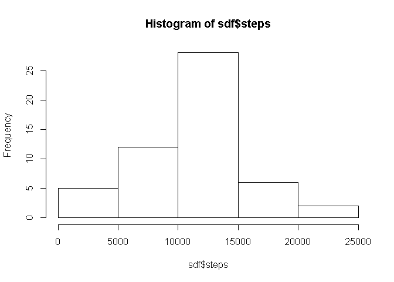
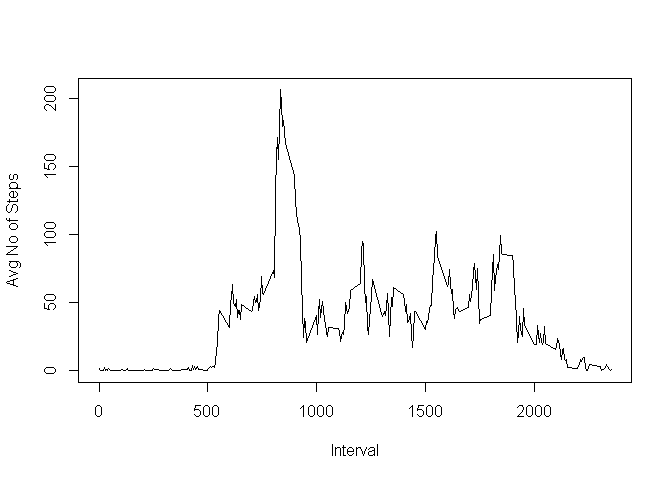
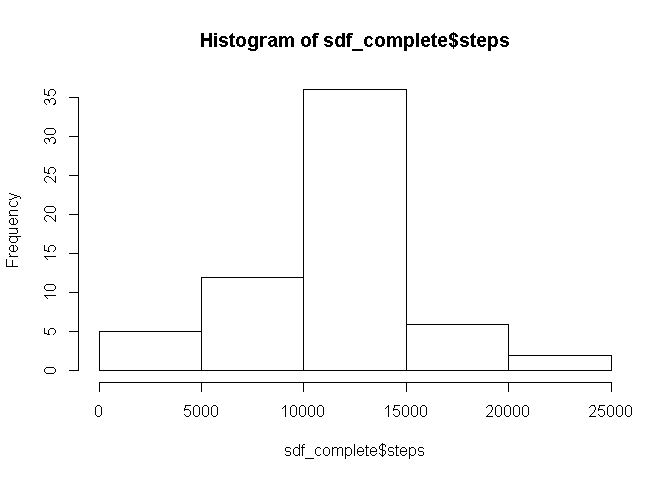
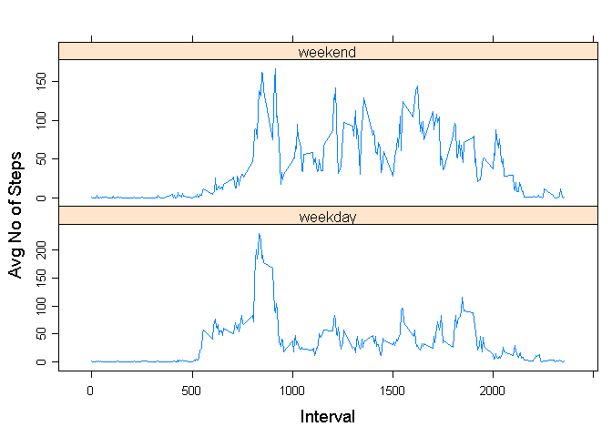

# PA1_template
Beecher Adams  
September 27, 2016  

# Reproducible Research - Course Project 1

Load the libraries


```r
  library(plyr)
  library(lattice)
```

Read in the data file.


```r
  df <- read.csv("C:/Users/beecher/Documents/Coursera/ReproResearch/Project1/repdata_data_activity/activity.csv")
```


## What is mean total number of steps taken per day?

Summarize for the number of steps each day.


```r
  sdf <- ddply(df, c("date"), summarize,
      steps = sum(steps))
```
  
Plot the histogram.


```r
  hist(sdf$steps)
```

<!-- -->
  
Calculate the mean and median.
  

```r
  mean(sdf$steps, na.rm = TRUE)
```

```
## [1] 10766.19
```

```r
  median(sdf$steps, na.rm = TRUE)
```

```
## [1] 10765
```

## What is the average daily activity pattern?
  
Find the average number of steps for each 5 min period across all days.


```r
  adf <- ddply(df, c("interval"), summarize,
               avg_steps = mean(steps, na.rm = TRUE))
```
  
Make a time series plot.


```r
  plot(adf$interval, adf$avg_steps, type = "l", xlab = "Interval", ylab = "Avg No of Steps")
```

<!-- -->
  
Calculate the number of missing values.


```r
  sum(is.na(df$steps))
```

```
## [1] 2304
```
  

## Imputing missing values

  
Create a new dataset with missing values filled in with the average for that interval.


```r
  df_complete <- df
  
  for(i in 1:nrow(df_complete)) {
    
    if (is.na(df_complete[i,1])) {
      index <- i %% 288
      if (index == 0) {index <- 288}
      df_complete[i,1] <- adf[index,2]
    }
    
  }
```
  
Summarize for number of steps each day.


```r
  sdf_complete <- ddply(df_complete, c("date"), summarize,
               steps = sum(steps))
```
  
Plot a histogram.


```r
  hist(sdf_complete$steps)
```

<!-- -->
  
Calculate the mean and the median.


```r
  mean(sdf_complete$steps, na.rm = TRUE)
```

```
## [1] 10766.19
```

```r
  median(sdf_complete$steps, na.rm = TRUE)
```

```
## [1] 10766.19
```
  
## Are there differences in activity patterns between weekdays and weekends?

Create a new factor variable with two levels "weekday" and "weekend".


```r
  df_complete$week_part <- weekdays(as.Date(df_complete$date))
  
  df_complete$week_part[df_complete$week_part == "Monday"] <- "weekday"
  df_complete$week_part[df_complete$week_part == "Tuesday"] <- "weekday"
  df_complete$week_part[df_complete$week_part == "Wednesday"] <- "weekday"
  df_complete$week_part[df_complete$week_part == "Thursday"] <- "weekday"
  df_complete$week_part[df_complete$week_part == "Friday"] <- "weekday"
  df_complete$week_part[df_complete$week_part == "Saturday"] <- "weekend"
  df_complete$week_part[df_complete$week_part == "Sunday"] <- "weekend"
  
  df_complete$week_part <- as.factor(df_complete$week_part)
```
  
Find the average number of steps for each 5 min interval across all days.


```r
  adf_complete <- ddply(df_complete, c("interval", "week_part"), summarize,
               avg_steps = mean(steps, na.rm = TRUE))
```
  
Make a time series plot.


```r
  xyplot(avg_steps~interval|week_part, data = adf_complete, type = "l",
         xlab=list(label="Interval", fontsize=14),
         ylab=list(label="Avg No of Steps", fontsize=14),
         scales = list(y=list(relation="free")),
         layout=c(1,2))
```

<!-- -->

As the above chart shows there are differences in activity patterns between weekdays and weekends. After the morning period on a weekday the activity is modest the rest of the day, but remains fairly active during the entire waking periods of the weekend.
